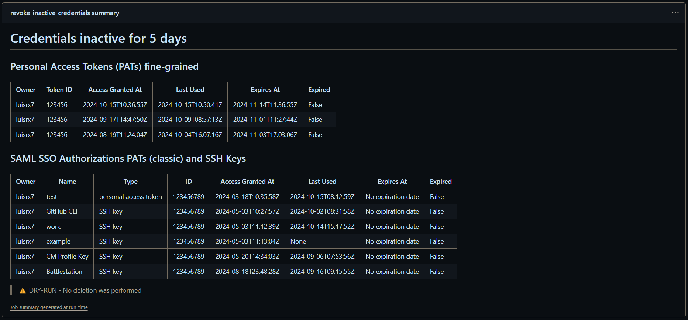

# Revoke inactive GitHub Organization credentials

This GitHub Action automates the revocation of unused Personal Access Tokens and SSH keys (credentials), enhancing organizational security by removing inactive credentials that haven't been accessed within a specified timeframe. Proactively eliminating these credentials reduces the risk of security breaches and ensures compliance with the organization's security policies.

## Where Can I Use This Action?

This action can only be used in organizations where Single Sign-On (SSO) is enabled.

## How Does It Work?

The action utilizes a GitHub App to authenticate against the GitHub API. It retrieves all associated credentials for the organization and checks the last time they were used. If a credential has not been utilized for the specified number of days, and it is not expired, the action revokes it.

## Why Should I Use This Action?

An increased attack surface results from having unused (but active) credentials within your organization. Revoking these credentials reduces the risk of unauthorized access to your organization. Furthermore, you only need to set it up once, and it will run automatically on a schedule you define, saving you time and effort.

## How to set up the action in your organization

## Prerequisites

### GitHub App

1. Create a GitHub App in the organization where you want to revoke credentials.
    - Repository permissions:
        - `metadata`: read-only
    - Organization permissions:
        - `administration`: read & write
        - `personal_access_token`: read & write
        - `members`: read-only
2. Generate a private key for the GitHub App.
3. Install the GitHub App in the organization.
4. Note the `App ID`, `private key`, and `installation ID`.
5. Encode the private key in `base64` format.
6. Store the App ID, encoded private key, and installation ID as `secrets` in the repository (update secret names as needed).

### Usage

You just need to add the action to your workflow file. Here is an example:

```yaml
- name: Revoke Inactive Credentials
        uses: tentwentyone/github-org-sso-auth-revoker@v1
        with:
          days: ${{github.event.inputs.days || 45}}
          dry-run: ${{github.event.inputs.dry-run || true}}
          whitelist: ${{github.event.inputs.whitelist || secrets.GH_CRED_REVOKER_WHITELIST }}

          # GitHub App credentials
          gh_app_id: ${{ secrets.GH_CRED_REVOKER_APP_ID }}
          gh_pem_key: ${{ secrets.GH_CRED_REVOKER_PEM_KEY }}
          gh_install_id: ${{ secrets.GH_CRED_REVOKER_INSTALL_ID }}
```

#### Complete workflow example

[Here](workflow.yml) you can find a complete example workflow that runs the action every week and revokes 45 days innactive credentials.

### Inputs

#### Configurable via manual trigger

- `dry-run` (boolean): Indicates whether the action should perform a dry run. Default is `true` when triggered manually and `false` when triggered by a schedule.
- `days` (number): Number of days to check for inactive credentials. Default is `45`.
- `whitelist` (string): List of credential IDs to ignore (comma separated). If empty, the `GH_WHITELIST` environment variable will be used.

> the default values will be used when the trigger is a shedule

#### Secrets

- `gh_app_id` (string): The GitHub App ID.
- `gh_pem_key` (string): The GitHub App private key (base64 encoded).
- `gh_install_id` (string): The GitHub App installation ID.

### Outputs

The results are added to the GitHub Actions summary.

#### Example summary



### How to list all / whitelist credentials linked to the organization

1. After setting up and running the action, you can run it manually with the `dry-run` input set to `true` and the `days` value set to `0`. This will list all the credentials associated with the organization.
2. Gather all the credential IDs that you want to preserve for whitelisting.
3. Set the `whitelist` input with a comma-separated list of the credential IDs (e.g., `123456, 123456789`).

## License

The scripts and documentation in this project are released under the [MIT License](LICENSE).

## Contributing

We welcome contributions! Please check our [guidelines](CONTRIBUTING.md) for details.

## Security Policy

Please see our [SECURITY.md](SECURITY.md) for details on our security policy and reporting security vulnerabilities.
